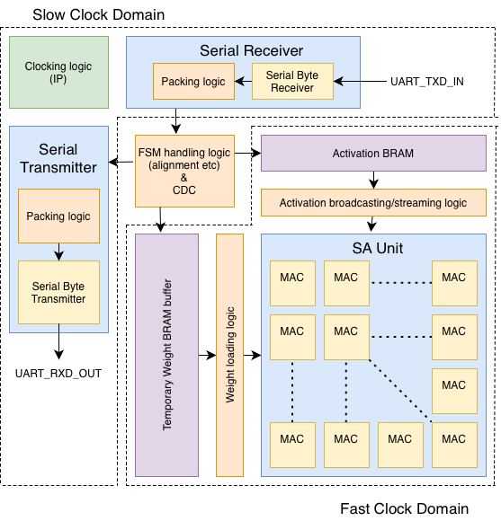
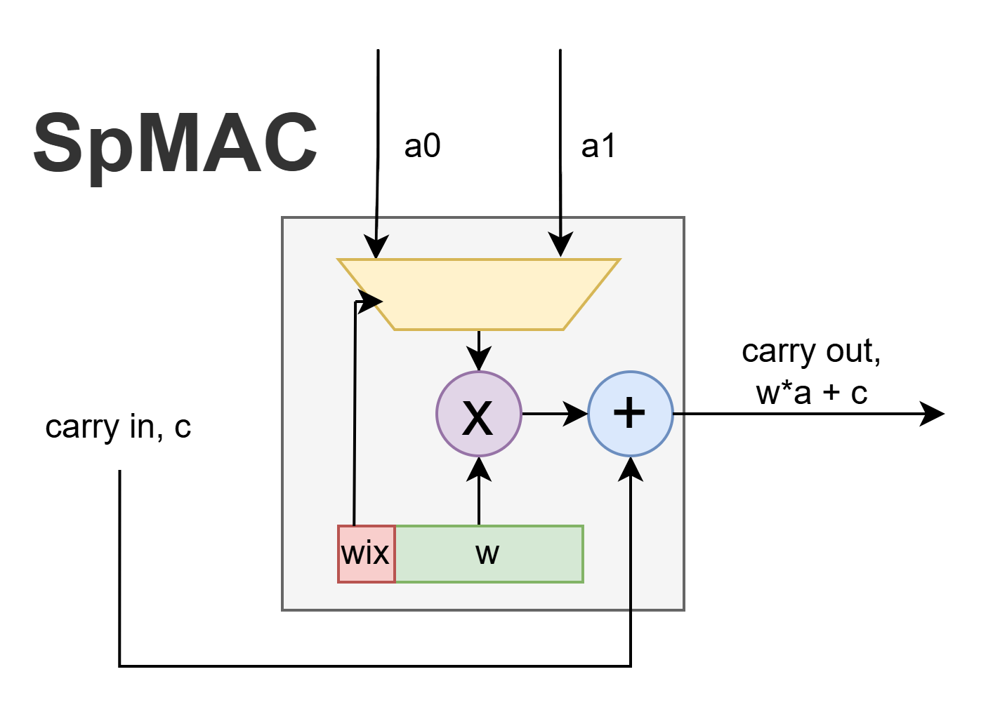
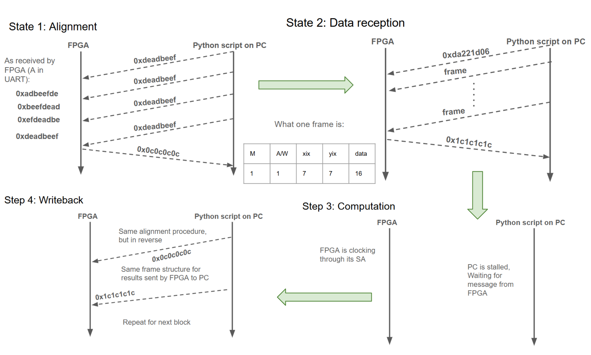
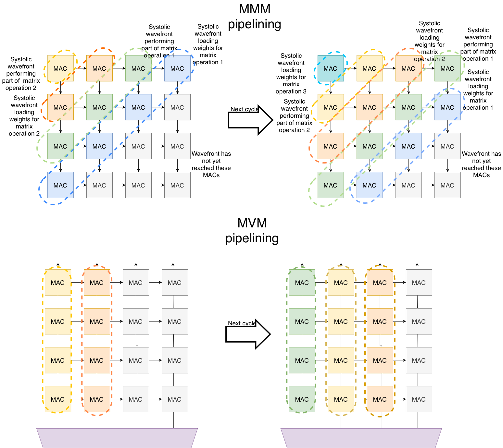

# Micro-Architectural Support for Packed-Sparse Matrix Multiplication on Hybrid Systolic Arrays
_An Architectural Exploration_

For a longer overview: [View Final Project Technical Report (PDF)](final-project-report.pdf)

## Introduction
Modern LLM inference suffers from a bifurcated compute pattern: the Prefill stage (compute-bound Matrix-Matrix Multiplies) and the Decode stage (memory-bound Matrix-Vector Multiplies). This architecture implements a Hybrid Systolic Array (HSA) that dynamically reconfigures its data-path to handle both phases within a single unified footprint, reducing total silicon area while maintaining high throughput.

Additionally, support for sparse-packed matrices is implemented at the hardware level to further reduce the footprint and drive up the energy efficiency at the tradeoff of some accuracy.

## Technical Specifications
| Spec | Implementation |
| ---- | --- |
| Quantization | 1-16 bit quantized, reconfigurable by parameter |
| Topology | Reconfigurable 1D Vector / 2D Matrix Weight-Stationary Systolic Array |
| Sparse-packing | Fixed reduction of MAC units and overall cycle counts by a factor of 2 |
| SA dimension | From 1 to 32 along each axis, reconfigurable by parameter (vertical axis halved for sparse units) |
| Verification | Directed and Random Verilog test benches; python program interfaces with custom driver to perform real-world on-device testing |
| Timing Closure | All units achieve 100MHz target on Artix-7 fabric |

## Architecture
The overall architecture can be seen in the following block diagram:

The MAC units change depending on which specific unit is being implemented (VPU/MPU/HSA etc). For the Sparse unit, the following structure is relevant:

The whole 'TPU' essentially acts as an FSM between the following states:
1. Receive data (alignment + weight loading)
2. Computation
3. Send data (alignment + result sending)

Since data packets (32 bits) from/to host must go through UART which is asynchronous and only communicates at most a byte at a time, the packets must be broken up into groups of 8 bits each of which is then sent along with a parity bit. If a single byte has an error detected then the whole packet is discarded, ensuring deterministic data alignment between python host-driver and FPGA asynchronous UART RX/TX buffers. A frame has the following structure:

| Message | Activation/Weight | x-index | y-index | data |
| --- | --- | --- | --- | --- |
| 1 bit | 1 bit | 7 bits | 7 bits | 16 bits |

The structure was developed so that the same transmission protocol could support up to 128 by 128 sized SAs, but the
hardware constraints of the FPGA only allowed for 32 by 32 (and in practice due to synthesis time, 8 by 8 was mostly used).

The custom protocol on top of UART is described in the following image:

Under 'uart_comms' a python driver for this transmission protocol can be found.
## Pipelining
A clever pipelining methodology for both MMM and MVM modes was devised, however it was only ever implmented in simulation. The following diagrams explain this well:

## Sparsity: Column packing and tagging
On a WS model, any 0-weight entry would map to an
essentially idle MAC unit. To reduce the sparsity, we pack
the matrix through column merging: Each element’s row is
kept invariant and elements must be tagged with the column
they came from. This allows for correction of the severe
underutilisation of MAC units. However, I noticed two key
things:
- Reducing EMA is our priority. Since most models are
low-bit quantized (Q < 8), adding tags increases EMA
if Q < log2 N. Since weight matrices are typically
large (N ∼ 2
10 − 2
14 for small models), including tags
guarantees added EMA and latency.
- Since each MAC now may need to keep track of values
from multiple different columns and make sure they
match with the activation value, MAC complexity increases.

So, my simplification is to merge only adjacent columns, and
discard the lower-valued weight arbitrarily. Since we only
merge adjacent columns, columns now need to be tagged
solely with the parity of their column index (one bit) and the need for additional memory elements in each MAC is
eliminated. For example,

$$
W  = \begin{bmatrix}
5 & 0 & 1 & 7\\
0 & 4 & 0 & 1\\
0 & 2 & 5 & 0\\
4 & 0 & 0 & 0
\end{bmatrix} \rightarrow W_\text{dense} \begin{bmatrix}
5, 0 & 7,1\\
4,1 & 1,1\\
2,1 & 5,0\\
4,0 & 0,0
\end{bmatrix}
$$

### Hardware-Complexity Tradeoff
The only added tradeoffs we incur with my simplification
is the following:
- Slight reduction in accuracy from sparse packing: for
example, in above matrix, row 1’s column 3’s value had
to be dropped.
- 1 additional EMA per cycle, as each column now needs
2 activation values, which can be achieved with an extra
read port to the activation memory, which is negligible
in comparison with the O(N) accesses for weights.
- 1 additional input port and mux in each of the MACs:
the additional input port is for the second activatino value,
and the mux will use the column parity tag as a select
bit so that the appropriate activation value is used for
the multiplication. This is far less than the added MAC
complexity from the STPU paper.

## Methodology
The hardware units are implemented in a C++ software
simulator (custom-built from scratch, cycle accurate) as well as
SystemVerilog modules, with Xilinx Vivado to synthesize
them. They will be tested on the AMD Artix A7 FPGA with
63400 LUTs, 126800 FFs, and 4860Kb of SRAM.

Given the memory and logic slice constraints on the Artix A7,
I originally estimate I would be able to fit a 32 by 32
SA unit, along with the accompanying driving logic, which
per my experimentation was in fact correct. However, due
to the development constraints on the laboratory PCs,
synthesising a 32 by 32 SA unit along with accompanying
logic would take around 1h30min, which would have severely
harmed the development time. So I settled for an 8x8 SA unit.

Aside from the C++ and SystemVerilog testbenches, a
proof-of-concept of only one unit (the VPU) was implemented
to a fully working status with a custom UART transmission
protocol as a coprocessor to the host PC (an accompanying
python driver was written), so that microbenchmarks consisting of randomly generated matrices could be run and verified.

The proof-of-concept can be easily extrapolated for other
units.

## Future Steps
While the modular Sparse-PE and VPU transmission protocols are fully validated, the global wrapper integration remains an area for future scaling. This project serves as a functional verification of the sparse-packed data-path, proving that the theoretical power savings of HSA-Sparse logic can be achieved on FPGA fabric.

**For a complete power and performance analysis please see the Final Report linked above**
